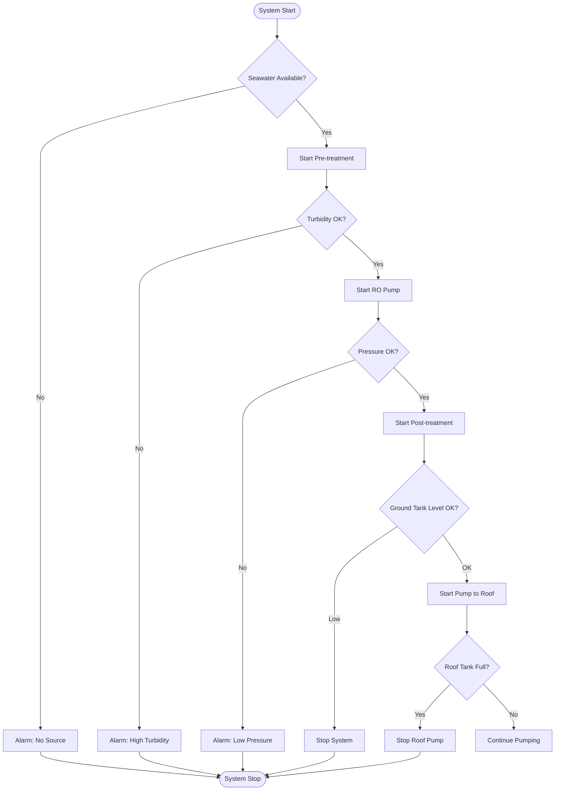
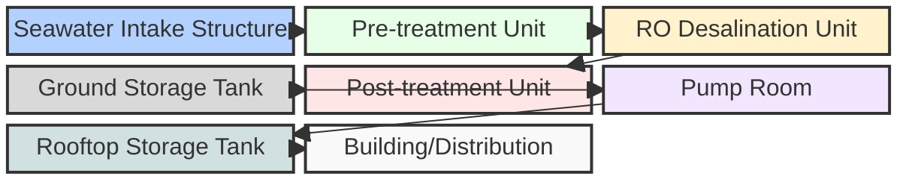

# Desalination System Flowchart (Mermaid)

```mermaid
flowchart LR
    A[Seawater Intake] -->|P-101, FT-101| B[Pre-treatment\nFiltration and Sediment Removal]
    B -->|P-102| C[RO Membrane\nDesalination]
    C -->|P-103| D[Post-treatment\nMineralization and Disinfection]
    D -->|P-104| E[Ground Tank]
    E -->|P-105| F[Pump to Rooftop]
    F --> G[Roof Tank]
    G -->|LT-102| H[Consumption]

    %% Sensors and valves
    A -.->|Valve V-101| B
    B -.->|Valve V-102| C
    C -.->|Valve V-103| D
    D -.->|Valve V-104| E
    E -.->|Valve V-105| F
    F -.->|Valve V-106| G
```

*Legend:*
- **P-101 ... P-106**: Pumps
- **FT**: Flow Transmitter
- **LT**: Level Transmitter
- **TU**: Turbidity Sensor
- **PT**: Pressure Transmitter
- **V-101 ... V-106**: Valves

# Control System Flowchart (Mermaid)

# Hardware Siteplan (Mermaid)

# Hardware Specifications are now in [hardware-spec.md](./hardware-spec.md)
