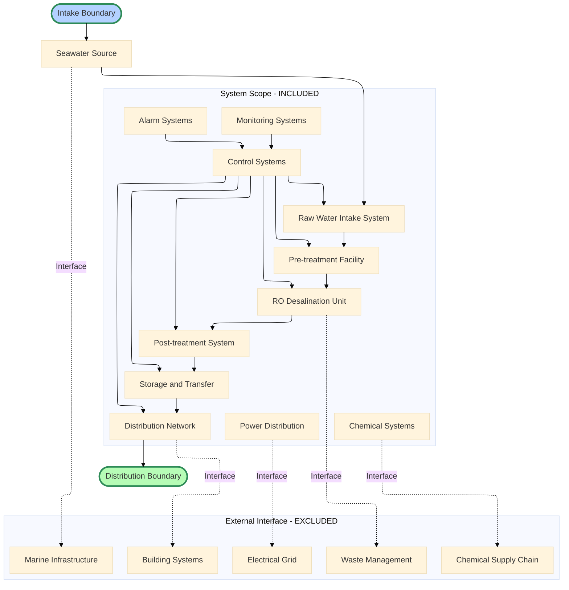
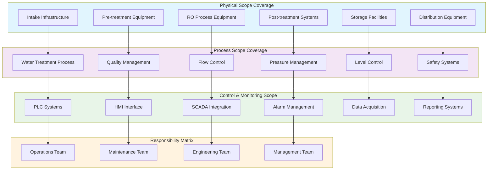
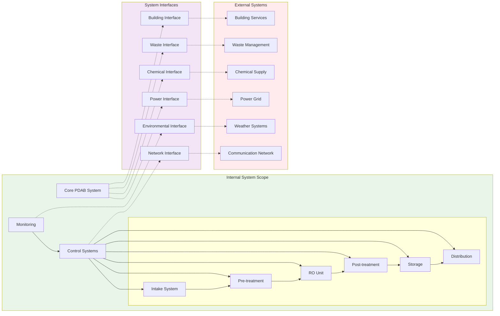

# Ruang Lingkup Sistem PDAB

## 2.1 Pendahuluan

Ruang lingkup sistem Pengolahan dan Distribusi Air Bersih (PDAB) mencakup semua aspek sistem yang dirancang untuk menghasilkan air bersih berkualitas tinggi melalui proses desalinasi. Dokumen ini menjelaskan batasan sistem secara detail, meliputi komponen fisik, operasional, dan kontrol yang tergabung dalam satu sistem distribusi air bersih.

Pentingnya mendefinisikan ruang lingkup sistem secara jelas adalah untuk memastikan semua pihak memiliki pemahaman yang sama tentang cakupan proyek, tanggung jawab masing-masing bagian sistem, dan hubungan dengan sistem luar. Ruang lingkup yang jelas akan mengurangi ketidakjelasan dalam pelaksanaan dan memudahkan proses perawatan serta pemecahan masalah.

## 2.2 Definisi Ruang Lingkup Sistem

Ruang lingkup sistem PDAB meliputi seluruh proses, mulai dari pengambilan air baku (intake), praolah (filtrasi dan penghilangan kotoran), proses utama (reverse osmosis), pascaolah (remineralisasi dan desinfeksi), penyimpanan air bersih, hingga distribusi kepada pengguna akhir. Selain itu, ruang lingkup juga mencakup sistem kontrol otomatis (PLC/HMI), pemantauan parameter proses, alarm, serta integrasi dengan sistem utilitas lain apabila diperlukan.

### 2.2.1 Cakupan Fungsional Sistem

Sistem PDAB dirancang untuk beroperasi sebagai instalasi pengolahan air terpadu dengan kemampuan:
- **Otomasi proses**: Kontrol otomatis seluruh tahapan proses
- **Jaminan kualitas**: Monitoring kualitas air secara terus-menerus
- **Optimisasi efisiensi**: Mengoptimalkan penggunaan energi dan tingkat recovery
- **Manajemen keamanan**: Sistem keamanan dan proteksi peralatan
- **Manajemen data**: Pengumpulan, analisis, dan pelaporan data operasional

## 2.3 Komponen Utama Ruang Lingkup Sistem

Sistem PDAB terdiri dari enam bagian utama yang saling terhubung untuk membentuk proses distribusi air bersih yang lengkap dan otomatis. Setiap bagian memiliki fungsi khusus dan berinteraksi dengan bagian lain melalui sistem kontrol terpusat.

### 2.3.1 Bagian Intake (Pengambilan Air Baku)

Bagian intake berfungsi sebagai titik masuk air laut ke dalam sistem distribusi dan merupakan tahap awal yang penting dalam proses desalinasi.

#### a) Komponen Utama Intake
- **Pompa P-101**: Pompa sentrifugal dengan kapasitas 50 m³/jam
  - Motor: 7.5 kW, 3-phase, 50 Hz
  - Tinggi angkat: 25 meter
  - Material: Cast iron dengan lapisan anti-korosi
  - Efisiensi: >80% pada titik operasi

- **Pengukur Aliran FT-101**: Pengukur aliran elektromagnetik
  - Jangkauan: 0-100 m³/jam dengan akurasi ±0.5%
  - Sinyal keluaran: 4-20 mA analog
  - Komunikasi: Protokol Modbus RTU
  - Kalibrasi: Kebutuhan kalibrasi tahunan

#### b) Sistem Proteksi dan Penyaringan Awal
- **Saringan Intake**: Saringan mekanik untuk menghilangkan kotoran
  - Ukuran mesh: 5mm untuk penyaringan kasar
  - Material: Stainless steel 316L
  - Pembersihan: Manual atau backwash otomatis
  
- **Proteksi Korosi**: Sistem proteksi katodik
  - Anoda korban untuk perlindungan korosi
  - Sistem monitoring untuk jadwal penggantian

### 2.3.2 Bagian Praolah (Pre-Treatment)

Tahap praolah melakukan penyaringan dasar untuk mempersiapkan air sebelum masuk ke unit RO, menghilangkan padatan tersuspensi dan klorin yang dapat merusak membran RO.

#### a) Sistem Penyaringan Bertingkat
- **Saringan Pasir**: Penyaringan dengan media pasir silika
  - Media: Pasir bertingkat dengan ukuran 0.5-1.5 mm
  - Laju alir: 10-15 m/jam per unit area
  - Frekuensi backwash: Setiap 24-48 jam
  
- **Saringan Karbon**: Karbon aktif untuk penghilangan klorin
  - Media: Karbon aktif granular (GAC)
  - Waktu kontak: Minimum 5 menit
  - Efisiensi penghilangan klorin: >99%

#### b) Monitoring dan Kontrol Kualitas
- **Sensor Kekeruhan TU-101**: Monitoring kekeruhan air
  - Jangkauan: 0-10 NTU dengan akurasi ±2%
  - Pengaturan alarm: >1 NTU untuk proteksi sistem
  - Pembersihan: Pembersihan ultrasonik otomatis
  
- **Tekanan Diferensial**: Monitoring untuk pemicu backwash
  - Jangkauan: 0-2 bar tekanan diferensial
  - Pemicu backwash: 0.5 bar penurunan tekanan

### 2.3.3 Bagian Unit RO (Reverse Osmosis)

Unit RO melakukan proses pemisahan garam melalui teknologi osmosis balik, merupakan inti dari sistem desalinasi dengan efisiensi penghilangan garam >99%.

#### a) Sistem Tekanan Tinggi
- **Pompa P-102**: Pompa tekanan tinggi untuk operasi RO
  - Kapasitas: 25 m³/jam pada 15 bar
  - Motor: 22 kW dengan kontrol VFD
  - Material: Stainless steel 316L
  - Efisiensi: >85% dengan operasi kecepatan variabel

- **Sensor Tekanan PT-101**: Monitoring tekanan umpan RO
  - Jangkauan: 0-25 bar dengan akurasi ±0.25%
  - Waktu respons: <1 detik
  - Keluaran: 4-20 mA dengan komunikasi digital

#### b) Sistem Membran dan Proteksi
- **Membran RO**: Membran polyamide spiral wound
  - Konfigurasi: Elemen membran 4" x 40"
  - Penolakan garam: >99.5% untuk NaCl
  - Tekanan operasi: 10-15 bar
  - Tingkat recovery: 40-50%

- **Katup Pelepas Tekanan PRV-101**: Proteksi sistem
  - Tekanan set: 18 bar (90% dari maksimum)
  - Kapasitas: 110% dari aliran pompa
  - Material: Stainless steel dengan seal EPDM

### 2.3.4 Bagian Pascaolah (Post-Treatment)

Bagian pascaolah menyelesaikan proses pengolahan untuk memastikan air produk memenuhi standar kualitas air minum WHO dan meningkatkan cita rasa.

#### a) Sistem Transfer dan Booster
- **Pompa P-103**: Pompa transfer untuk post-treatment
  - Kapasitas: 20 m³/jam pada 5 bar
  - Motor: 5.5 kW dengan soft starter
  - Kontrol: Start/stop otomatis berdasarkan tekanan
  
#### b) Disinfeksi dan Sterilisasi
- **Unit UV-101**: Sistem disinfeksi UV
  - Lampu UV: Lampu merkuri tekanan rendah 150W
  - Dosis UV: 40 mJ/cm² untuk pengurangan 4-log
  - Monitoring: Sensor intensitas UV dengan alarm
  - Umur lampu: 8000-9000 jam operasi

- **Disinfeksi Sisa**: Sistem klorinasi (opsional)
  - Sistem dosing sodium hypochlorite
  - Laju dosing: 0.5-1.0 mg/L klorin bebas
  - Waktu kontak: Minimum 30 menit

#### c) Remineralisasi dan Penyesuaian pH
- **Saringan Kalsit**: Untuk remineralisasi air RO
  - Media: Kalsit dan magnesium oksida
  - Waktu kontak: 10-15 menit
  - Penyesuaian pH: rentang 6.5-8.5

### 2.3.5 Bagian Penyimpanan dan Transfer

Sistem penyimpanan menyediakan kapasitas penyangga dan memastikan pasokan air berkelanjutan dengan kualitas terjaga melalui pengelolaan penyimpanan yang tepat.

#### a) Konfigurasi Tangki Penyimpanan
- **Tangki Darat**: Penyimpanan utama
  - Kapasitas: 10,000 L (10 m³)
  - Material: Baja tahan karat 316L kualitas makanan
  - Sensor Ketinggian LT-101: Pengirim sinyal ketinggian ultrasonik
    - Jangkauan: 0-4 meter dengan akurasi ±0.5%
    - Alarm ketinggian rendah: 20% kapasitas
    - Alarm ketinggian tinggi: 90% kapasitas

- **Tangki Atap**: Tangki distribusi
  - Kapasitas: 5,000 L (5 m³)
  - Tinggi: 15 meter untuk distribusi gravitasi
  - Sensor Ketinggian LT-102: Pengirim sinyal berbasis tekanan
    - Jangkauan: 0-3 meter dengan akurasi ±0.25%
    - Kontrol pengisian otomatis: Mulai 30%, Berhenti 85%

#### b) Pengelolaan Sistem Transfer
- **Logika Transfer**: Kontrol otomatis berbasis PLC
  - Kunci pompa dengan sensor ketinggian
  - Perlindungan operasi kering untuk keamanan pompa
  - Optimisasi energi dengan operasi berbasis waktu
  
- **Pemeliharaan Kualitas Air**: Sirkulasi dan pemantauan
  - Pompa sirkulasi untuk menjaga kualitas air
  - Pengelolaan waktu tinggal (<24 jam)
  - Pemantauan suhu untuk kontrol bakteri

### 2.3.6 Bagian Distribusi dan Kontrol

Bagian distribusi menggambarkan transfer air dari penyimpanan menuju titik konsumsi dengan sistem kontrol terpadu yang memastikan operasi optimal dan dapat diandalkan.

#### a) Jaringan Distribusi
- **Distribusi Utama**: Jaringan pipa utama
  - Material pipa: HDPE PE100 atau baja tahan karat
  - Diameter: 4" untuk jalur utama, 2" untuk jalur sekunder
  - Peringkat tekanan: PN16 (16 bar)
  - Kecepatan aliran: 1.5-2.5 m/s untuk efisiensi optimal

- **Distribusi Sekunder**: Jaringan cabang
  - Sambungan layanan ke pengguna akhir
  - Katup penurun tekanan untuk pengelolaan tekanan
  - Katup isolasi untuk perawatan
  - Meteran alir untuk pemantauan konsumsi

#### b) Integrasi Sistem Kontrol
- **Sistem PLC**: Kontrol pusat dan koordinasi
  - Model: Siemens S7-1200 atau setara
  - Kapasitas I/O: 64 titik digital, 32 titik analog
  - Komunikasi: Ethernet, Modbus RTU/TCP
  - Pemrograman: Standar IEC 61131-3

- **Antarmuka HMI**: Antarmuka operator dan pemantauan
  - Layar: Layar sentuh berwarna 12"
  - Perangkat lunak: WinCC atau alternatif sumber terbuka
  - Fitur: Pemantauan waktu nyata, manajemen alarm
  - Pencatatan data: Tren historis dan pelaporan

- **Sistem Alarm**: Manajemen alarm komprehensif
  - Alarm audio-visual untuk parameter kritis
  - Notifikasi jarak jauh via SMS/email
  - Pencatatan kejadian dengan cap waktu
  - Prioritas alarm dan eskalasi

## 2.4 Prinsip Ruang Lingkup dan Batasan Sistem

### 2.4.1 Batasan Geografis dan Fisik

Sistem PDAB memiliki batas yang jelas untuk menentukan area cakupan dan tanggung jawab operasional serta perawatan.

#### a) Batasan Horizontal
- **Batas Pengambilan**: Dimulai dari struktur pengambilan di sumber air
  - Termasuk: Pompa pengambilan, penyaring, dan sistem perlindungan
  - Tidak termasuk: Infrastruktur sumber air (laut/air tanah)
  
- **Batas Distribusi**: Berakhir di titik sambungan layanan
  - Termasuk: Semua saluran pipa hingga batas properti
  - Tidak termasuk: Pipa dalam bangunan
  
#### b) Batasan Vertikal
- **Batas Bawah**: Tingkat pondasi untuk semua peralatan
  - Termasuk: Pondasi pompa, pondasi tangki
  - Tidak termasuk: Pekerjaan sipil di luar dukungan peralatan

- **Batas Atas**: Ketinggian maksimum tangki tinggi
  - Termasuk: Semua struktur hingga ketinggian 20 meter
  - Tidak termasuk: Lampu penghalang penerbangan (jika diperlukan)

#### c) Cakupan Area Layanan
- **Area Layanan Utama**: Radius 500 meter dari pusat distribusi
  - Area cakupan aliran gravitasi
  - Tekanan memadai untuk layanan langsung
  
- **Area Layanan Sekunder**: Cakupan diperluas dengan pompa pendorong
  - Pemompaan tambahan untuk pemeliharaan tekanan
  - Cakupan hingga radius 1000 meter

### 2.4.2 Batasan Kapasitas dan Kinerja

#### a) Kapasitas Produksi
- **Kapasitas Nominal**: 25 m³/hari (1000 L/jam)
  - Laju alir rancangan untuk operasi berkelanjutan
  - Kapasitas puncak: 150% dari nominal (jangka pendek)
  - Kapasitas minimum: 50% dari nominal (rasio turn-down)

- **Tingkat Pemulihan**: 40-50% untuk proses RO
  - Efisiensi pemanfaatan air umpan
  - Pembuangan konsentrat: 50-60% dari air umpan
  - Konsumsi energi: <4 kWh/m³ air produk

#### b) Standar Kinerja Kualitas
- **Kualitas Air Produk**: Sesuai dengan standar WHO
  - TDS: <500 mg/L (target <300 mg/L)
  - Kekeruhan: <1 NTU
  - pH: 6.5-8.5
  - Klorin bebas: 0.2-0.5 mg/L (jika diklorinasi)
  - Mikrobiologi: Nol organisme patogen

- **Keandalan Sistem**: Ketersediaan minimum 95%
  - Perawatan terencana: <5% waktu henti tahunan
  - Gangguan tidak terencana: <2% waktu henti tahunan
  - Waktu Rata-rata Antar Kegagalan: >1000 jam

### 2.4.3 Batasan Operasional dan Ketersediaan

#### a) Mode Operasi
- **Mode Otomatis**: Operasi berkelanjutan normal
  - Operasi terkontrol PLC berdasarkan permintaan
  - Urutan start/stop otomatis
  - Fungsi diagnosis diri dan perlindungan

- **Mode Manual**: Operasi terkontrol operator
  - Operasi panel kontrol lokal
  - Pembatalan untuk fungsi otomatis
  - Mode perawatan untuk layanan peralatan

#### b) Kondisi Operasi Lingkungan
- **Rentang Suhu**: 5°C hingga 45°C lingkungan
  - Penurunan peralatan pada suhu ekstrem
  - Perlindungan beku untuk pipa luar ruangan
  
- **Kelembaban**: Kelembaban relatif hingga 85%
  - Selungkup IP65 untuk peralatan luar ruangan
  - Ventilasi untuk panel kontrol

- **Catu Daya**: 380V, 3-fase, 50Hz ±5%
  - Kemampuan cadangan daya darurat
  - UPS untuk sistem kontrol
  - Pemantauan kualitas daya

## 2.5 Karakteristik Ruang Lingkup Sistem

#### a) Parameter Rancangan
Parameter rancangan meliputi optimasi hidrolik untuk efisiensi energi (pemilihan pompa sesuai kurva sistem, ukuran pipa optimal, minimisasi kehilangan tekanan) dan optimasi proses membran (laju fluks 15-20 L/m²/jam, pemulihan disesuaikan kualitas air umpan, pembersihan bulanan atau sesuai kinerja).

#### b) Pemantauan Kinerja
Pemantauan kinerja dilakukan melalui indikator utama seperti konsumsi energi spesifik (kWh/m³), tingkat pemulihan air, ketersediaan sistem, dan kepatuhan kualitas air produk. Metrik operasional meliputi laju alir di seluruh titik ukur, perbedaan tekanan di komponen utama, konsumsi daya per bagian sistem, serta tingkat konsumsi bahan kimia.

### 2.5.2 Fleksibilitas dan Skalabilitas
Pendekatan modular dan skalabilitas sistem kontrol didukung secara terbatas pada simulasi, namun ekspansi kapasitas, infrastruktur listrik masa depan, serta peningkatan teknologi (protokol komunikasi standar, antarmuka standar, dokumentasi modifikasi) tidak diimplementasikan dalam program dan dihapus dari ruang lingkup.

## 2.6 Standar dan Compliance

### 2.6.1 Standar Teknis dan Industri

#### a) Standar Internasional
- **ISO 24510**: Kegiatan Layanan Penyediaan Air
  - Sistem manajemen kualitas untuk utilitas air
  - Indikator kinerja untuk penilaian layanan
  - Standar pengukuran kepuasan pelanggan

- **Pedoman WHO**: Kualitas Air Minum (Edisi ke-4)
  - Standar kualitas kimia dan target berbasis kesehatan
  - Persyaratan kualitas mikrobiologi
  - Parameter kualitas radiologi

- **Standar AWWA**: Asosiasi Kerja Air Amerika
  - C652: Disinfeksi Fasilitas Penyimpanan Air
  - C651: Disinfeksi Pipa Air Utama
  - M6: Pemilihan, Instalasi, Pengujian Meteran Air

#### b) Standar Proses dan Peralatan
- **Standar ASTM**: Standar material dan pengujian
  - D1129: Definisi terminologi air
  - D2777: Prosedur pengujian membran
  - D5465: Penentuan kekeruhan

- **Standar ASME**: Bejana tekan dan keselamatan
  - Bagian VIII: Rancangan bejana tekan
  - B31.3: Rancangan pipa proses
  - PTC 8.2: Pengujian pompa sentrifugal

### 2.6.2 Keselamatan dan Kepatuhan Lingkungan

#### a) Standar Keselamatan Listrik
- **IEC 60364**: Instalasi listrik dalam bangunan
  - Perlindungan terhadap sengatan listrik
  - Perlindungan terhadap efek termal
  - Perlindungan terhadap arus berlebih

- **Peringkat IP**: Perlindungan masuk untuk selungkup
  - Minimum IP54 untuk peralatan luar ruangan
  - IP65 untuk area terendam atau cuci tekan
  - IP67 untuk aplikasi bawah air

#### b) Peraturan Lingkungan
- **ISO 14001**: Sistem Manajemen Lingkungan
  - Kebijakan dan tujuan lingkungan
  - Minimisasi limbah dan daur ulang
  - Peningkatan efisiensi energi

- **Standar Pembuangan**: Peraturan pembuangan konsentrat
  - Batas salinitas untuk pembuangan laut
  - Pembatasan laju alir
  - Penilaian dampak lingkungan

## 2.7 Antarmuka dengan Sistem Eksternal

### 2.7.1 Antarmuka Utilitas

#### a) Antarmuka Daya Listrik
- **Daya Utama**: Persyaratan sambungan jaringan
  - Tegangan: 380V, 3-fase, 50Hz
  - Faktor daya: >0.85 lagging
  - Total beban terhubung: 45 kW
  - Faktor permintaan: 0.7 untuk ukuran

- **Daya Cadangan**: Ketentuan daya darurat
  - Generator diesel: Rating siaga 60 kVA
  - Sakelar transfer otomatis
  - Prioritas beban kritis

#### b) Antarmuka Komunikasi
- **Konektivitas Internet**: Pemantauan dan kontrol jarak jauh
  - Koneksi broadband untuk akses SCADA
  - Terowongan VPN untuk komunikasi aman
  - Persyaratan bandwidth: Minimum 10 Mbps

- **Komunikasi Seluler**: Komunikasi cadangan
  - Modem 4G/LTE untuk notifikasi alarm
  - Gateway SMS untuk alarm kritis
  - Transmisi data untuk pemantauan jarak jauh

### 2.7.2 Antarmuka Lingkungan

#### a) Antarmuka Sumber Air
- **Antarmuka Pengambilan**: Sambungan ke sumber air
  - Persyaratan penyaringan untuk perlindungan puing
  - Pengukuran alir untuk pemantauan sumber
  - Pemantauan kualitas untuk optimisasi proses

#### b) Antarmuka Pembuangan
- **Pembuangan Konsentrat**: Pembuangan air sisa RO
  - Titik pembuangan ke air penerima yang sesuai
  - Pengukuran alir dan pemantauan kualitas
  - Pemantauan kepatuhan lingkungan

## 2.8 Validasi dan Verifikasi Ruang Lingkup

### 2.8.1 Proses Validasi Ruang Lingkup

#### a) Validasi Teknis
- **Tinjauan Rancangan**: Proses tinjauan multi-disiplin
  - Tinjauan insinyur proses untuk integrasi sistem
  - Tinjauan insinyur listrik untuk sistem daya
  - Tinjauan insinyur kontrol untuk sistem otomasi
  - Tinjauan insinyur lingkungan untuk kepatuhan

- **Tinjauan Pemangku Kepentingan**: Validasi persyaratan pengguna
  - Masukan operator untuk persyaratan operasional
  - Masukan tim perawatan untuk aksesibilitas
  - Persetujuan manajemen untuk persyaratan bisnis

#### b) Validasi Kinerja
- **Pengujian Kapasitas**: Verifikasi kinerja sistem
  - Pengujian laju alir pada kondisi rancangan
  - Pengujian tekanan untuk integritas sistem
  - Pengujian kualitas untuk kepatuhan produk
  - Pengukuran konsumsi energi

- **Pengujian Integrasi**: Verifikasi antarmuka sistem
  - Pengujian komunikasi antar bagian sistem
  - Pengujian sistem alarm
  - Pengujian mati darurat
  - Verifikasi pencatatan data

### 2.8.2 Manajemen Ruang Lingkup dan Kontrol Perubahan

#### a) Proses Manajemen Perubahan
- **Permintaan Perubahan**: Proses formal untuk perubahan ruang lingkup
  - Penilaian dampak untuk biaya dan jadwal
  - Tinjauan teknis untuk kelayakan
  - Alur persetujuan dengan penandatanganan pemangku kepentingan

- **Manajemen Konfigurasi**: Kontrol dokumentasi sistem
  - Kontrol versi untuk dokumen rancangan
  - Pemeliharaan dokumentasi as-built
  - Pelacakan riwayat perubahan

#### b) Peningkatan Berkelanjutan
- **Pemantauan Kinerja**: Optimisasi sistem berkelanjutan
  - Pelacakan dan analisis KPI
  - Benchmarking dengan standar industri
  - Identifikasi peluang peningkatan

- **Pembaruan Teknologi**: Perencanaan modernisasi sistem
  - Pengembangan peta jalan teknologi
  - Manajemen keusangan
  - Studi kelayakan upgrade

## 2.9 Kesimpulan Ruang Lingkup Sistem PDAB

Ruang lingkup sistem PDAB yang telah didefinisikan memberikan kerangka kerja komprehensif untuk memahami aspek sistem distribusi air melalui teknologi desalinasi dalam konteks implementasi yang terpadu. Definisi ruang lingkup ini mencakup batasan fisik, cakupan proses, integrasi kontrol, dan manajemen antarmuka yang sesuai dengan implementasi aktual sistem.

### 2.9.1 Keunggulan Definisi Ruang Lingkup

#### a) Kejelasan dan Kelengkapan
- **Definisi Batasan**: Setiap batasan dan tanggung jawab telah didefinisikan secara jelas untuk menghindari ketidakjelasan dalam implementasi
- **Spesifikasi Teknis**: Spesifikasi teknis yang detail memberikan panduan untuk pengadaan dan instalasi
- **Kerangka Integrasi**: Antarmuka antar bagian sistem didefinisikan untuk memastikan integrasi yang mulus

#### b) Keunggulan Operasional
- **Standar Kinerja**: KPI dan metrik terdefinisi untuk pemantauan kinerja
- **Persyaratan Keselamatan**: Kepatuhan dengan standar internasional untuk operasi yang aman
- **Pertimbangan Lingkungan**: Operasi berkelanjutan dengan dampak lingkungan minimal

### 2.9.2 Implementasi dan Nilai Strategis

#### a) Dukungan Implementasi Proyek
- **Ruang Lingkup Jelas**: Ruang lingkup yang terdefinisi dengan baik mengurangi risiko proyek dan kelebihan biaya
- **Keselarasan Pemangku Kepentingan**: Pemahaman umum tentang hasil proyek
- **Jaminan Kualitas**: Kepatuhan standar memastikan kualitas produk

#### b) Penciptaan Nilai Jangka Panjang
- **Skalabilitas**: Rancangan modular memungkinkan ekspansi masa depan
- **Kemudahan Perawatan**: Komponen standar dan dokumentasi memudahkan perawatan
- **Peta Jalan Teknologi**: Rancangan tahan masa depan untuk peningkatan teknologi

Melalui kombinasi definisi batasan yang jelas, spesifikasi teknis komprehensif, kepatuhan standar yang ketat, dan proses validasi sistematis, sistem PDAB memberikan solusi yang dapat diandalkan, efisien, dan berkelanjutan untuk aplikasi pengolahan air. Definisi ruang lingkup ini menjadi fondasi untuk implementasi proyek yang sukses dan keunggulan operasional jangka panjang.

## 2.10 Lampiran: Flowchart dan Diagram Ruang Lingkup Sistem

### Diagram Alir Ruang Lingkup: Batasan Sistem

### Diagram Alir Area Cakupan dan Tanggung Jawab

### Diagram Antarmuka Sistem dan Batasan Eksternal

