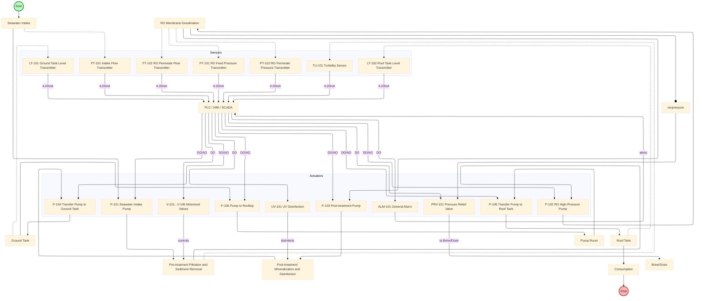
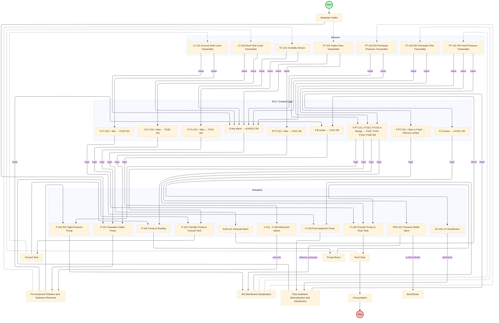
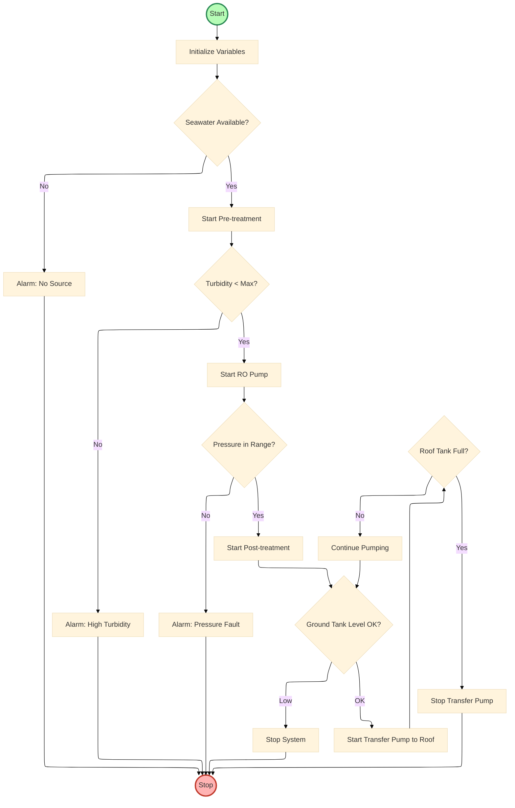

# Model Sistem PDAB

Model sistem PDAB dapat digambarkan sebagai rangkaian proses otomatis yang terdiri dari:
1. **Intake**: Pengambilan air baku menggunakan pompa submersible.
2. **Pra-perlakuan**: Filtrasi multi-media dan cartridge filter untuk menghilangkan partikel dan kekeruhan.
3. **RO Unit**: Proses reverse osmosis untuk memisahkan garam dan kontaminan.
4. **Pasca-perlakuan**: Remineralisasi dan desinfeksi (UV atau klorin).
5. **Penyimpanan**: Tangki ground dan rooftop.
6. **Distribusi**: Pompa transfer dan booster ke titik pemakaian.
7. **Kontrol Otomatis**: PLC/HMI menjalankan logika berdasarkan input sensor dan status aktuator.

Model ini divisualisasikan dalam flowchart dan P&ID pada dokumen proyek.

## Lampiran: Flowchart dan Arsitektur Sistem Desalinasi

### Flowchart Proses dan Kontrol

### Flowchart Algoritma Logika Kontrol

### Hardware Siteplan

```mermaid
flowchart LR
    Intake["Seawater Intake Structure"] --"Raw Seawater"--> Pretreat["Pre-treatment Unit"] 
    Pretreat --"Filtered Water"--> RO["RO Desalination Unit"]
    RO --"Permeate (Fresh Water)"--> Post["Post-treatment Unit"]
    Post --"Treated Fresh Water"--> Ground["Ground Storage Tank"]
    Ground --"Water Transfer"--> Pump["Pump Room"]
    Pump --"Pressurized Water"--> Roof["Rooftop Storage Tank"]
    Roof --"Distribution"--> Building["Building/Distribution"]
    
    %% Waste streams
    RO -.->|"Brine/Concentrate"| Waste["Waste Discharge"]
    
    style Intake fill:#b3d1ff,stroke:#333,stroke-width:2px
    style Pretreat fill:#e6ffe6,stroke:#333,stroke-width:2px
    style RO fill:#fff2cc,stroke:#333,stroke-width:2px
    style Post fill:#ffe6e6,stroke:#333,stroke-width:2px
    style Ground fill:#d9d9d9,stroke:#333,stroke-width:2px
    style Pump fill:#f2e6ff,stroke:#333,stroke-width:2px
    style Roof fill:#d1e0e0,stroke:#333,stroke-width:2px
    style Building fill:#f9f9f9,stroke:#333,stroke-width:2px
    style Waste fill:#ffcccc,stroke:#333,stroke-width:2px
```

*Diagram siteplan ini menampilkan hubungan antar unit utama pada sistem desalinasi sesuai layout fisik dan alur proses air.*

### Flowchart Model: Fungsi dan Hubungan PLC dalam Sistem Desalinasi

*Flowchart ini menjelaskan hubungan antara sensor, PLC (logic group), dan aktuator dalam sistem desalinasi. Semua sinyal sensor diproses oleh PLC untuk mengaktifkan/mematikan aktuator sesuai logika kontrol yang telah diprogram.*

### Flowchart Model: Fungsi dan Hubungan PLC untuk Algoritma Logika Kontrol

*Flowchart ini menggambarkan algoritma logika kontrol utama pada sistem desalinasi, dengan node Start berwarna hijau dan Stop berwarna merah untuk memperjelas status awal dan akhir proses.*
