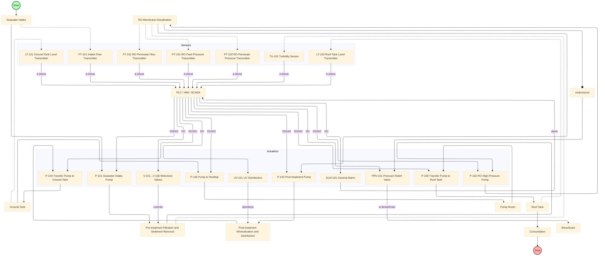
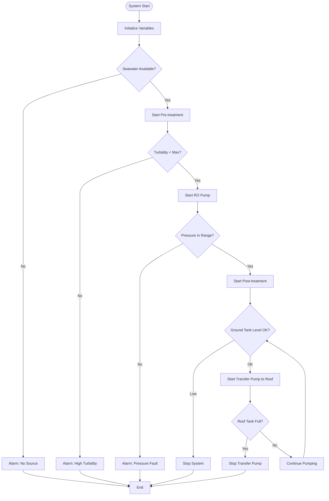
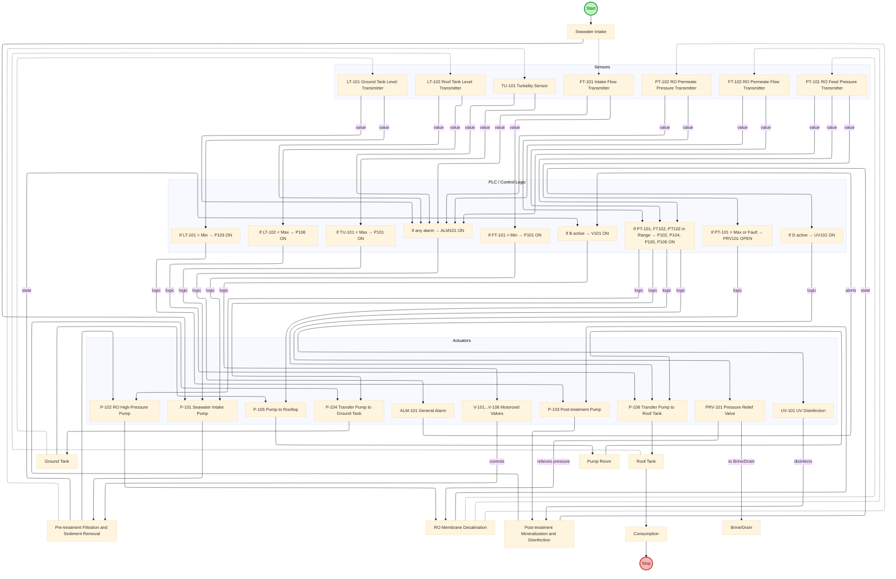
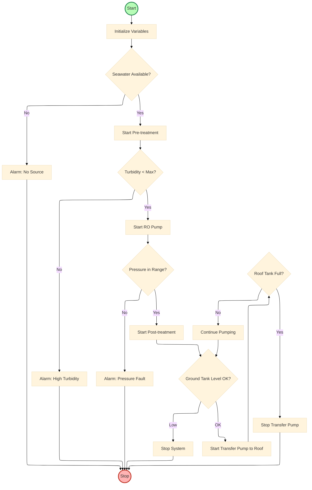

# Model Sistem PDAB

## 4.1 Pendahuluan

Model sistem Pengolahan Desalinasi Air Bersih (PDAB) merupakan representasi sistem simulasi yang menggambarkan proses dasar desalinasi air laut menggunakan teknologi reverse osmosis. Model ini dirancang sebagai platform pembelajaran dan demonstrasi untuk memahami prinsip-prinsip fundamental operasi sistem desalinasi dalam lingkungan terkontrol.

## 4.2 Komponen Utama Sistem PDAB

Sistem PDAB terdiri dari tujuh subsistem utama yang saling terintegrasi untuk membentuk proses desalinasi yang komprehensif dan otomatis.

### 4.2.1 Subsistem Intake (Pengambilan Air Baku)

Subsistem intake berfungsi sebagai titik masuk air laut ke dalam sistem simulasi. Pompa P-101 disimulasikan untuk mengangkat air laut dari sumber menuju tahap pra-perlakuan. Sensor FT-101 mengukur laju aliran air masuk dan memberikan data ke sistem kontrol untuk monitoring operasi pompa.

### 4.2.2 Subsistem Pra-perlakuan (Pre-treatment)

Tahap pra-perlakuan dalam simulasi melakukan filtrasi dasar untuk mempersiapkan air sebelum masuk ke unit RO. Sensor TU-101 memantau tingkat kekeruhan air dan memberikan data ke sistem kontrol. Valve V-101 mengatur aliran dalam sistem simulasi.

### 4.2.3 Subsistem RO Unit (Reverse Osmosis)

Unit RO dalam simulasi melakukan proses pemisahan garam melalui simulasi osmosis balik. Pompa P-102 menyediakan tekanan tinggi yang diperlukan untuk operasi membran RO. Sistem monitoring terdiri dari sensor PT-101 dan PT-102 yang memantau tekanan feed dan permeate, sementara FT-102 mengukur aliran produksi air tawar. Pressure relief valve PRV-101 berfungsi sebagai sistem keamanan untuk mencegah kondisi tekanan berlebih.

### 4.2.4 Subsistem Pasca-perlakuan (Post-treatment)

Subsistem pasca-perlakuan dalam simulasi menyelesaikan proses treatment dasar sebelum penyimpanan. Pompa P-103 mengalirkan air dari RO unit menuju tahap akhir. Unit disinfeksi UV-101 disimulasikan untuk sterilisasi menggunakan sinar ultraviolet.

### 4.2.5 Subsistem Penyimpanan

Sistem penyimpanan dalam simulasi terdiri dari ground tank sebagai penyimpanan utama yang dilengkapi sensor level LT-101, dan rooftop tank sebagai tangki distribusi dengan sensor level LT-102. Sistem transfer menggunakan pompa P-104, P-105, dan P-106 untuk mengalirkan air antar tangki berdasarkan level yang telah ditetapkan dalam logika kontrol.

### 4.2.6 Subsistem Distribusi

Subsistem distribusi dalam simulasi menggambarkan transfer air dari storage menuju titik konsumsi. Pump room disimulasikan untuk menampung peralatan transfer dan sistem pompa bekerja untuk mempertahankan aliran distribusi dalam simulasi.

### 4.2.7 Subsistem Kontrol Otomatis

Subsistem kontrol dalam simulasi menggunakan logika sederhana untuk mengkoordinasikan operasi dasar sistem. Sistem kontrol berbasis Python memproses sinyal dari sensor dan mengontrol aktuator berdasarkan algoritma yang telah diprogram. HMI (Human Machine Interface) menggunakan Tkinter untuk menyediakan interface operator sederhana untuk monitoring dan kontrol manual. Sistem alarm ALM-101 memberikan indikasi kondisi abnormal dalam simulasi.

## 4.3 Prinsip Operasi dan Integrasi Sistem

### 4.3.1 Model Operasional

Sistem PDAB beroperasi berdasarkan prinsip simulasi dengan kontrol otomatis sederhana yang mengintegrasikan subsistem dalam satu kesatuan operasional. Operasi sistem dimulai dengan inisialisasi dimana sistem melakukan pengecekan status komponen dasar. Monitoring dilakukan melalui tujuh sensor utama yang memberikan data ke sistem kontrol untuk pengambilan keputusan operasional dasar.

### 4.3.2 Model Interaksi Sensor-Controller-Aktuator

Sistem menggunakan arsitektur closed-loop control sederhana dengan tiga layer utama. Input layer terdiri dari tujuh sensor utama (TU-101, FT-101, FT-102, PT-101, PT-102, LT-101, LT-102) yang mengumpulkan data operasional. Processing layer berupa logika kontrol Python dengan algoritma dasar yang memproses data sensor dan membuat keputusan kontrol berdasarkan setpoints sederhana. Output layer terdiri dari sepuluh aktuator termasuk pompa, valve, UV, dan alarm yang mengeksekusi perintah dari sistem kontrol.

### 4.3.3 Model Keandalan dan Redundansi

Desain simulasi mengimplementasikan sistem keamanan dasar dimana sistem secara otomatis berhenti pada kondisi alarm atau parameter di luar batas normal yang telah ditetapkan dalam konfigurasi sistem.

## 4.4 Karakteristik Model Sistem

### 4.4.1 Kapasitas dan Performance

Sistem PDAB dirancang sebagai simulasi pembelajaran dengan parameter operasi yang dapat disesuaikan melalui file konfigurasi. Sistem menggunakan nilai-nilai simulasi untuk recovery rate, kualitas output, dan efisiensi energi untuk tujuan demonstrasi prinsip dasar operasi desalinasi.

### 4.4.2 Fleksibilitas Operasi

Desain simulasi memungkinkan modifikasi parameter operasi melalui file konfigurasi tanpa mengubah kode utama. Sistem dapat beroperasi dalam mode otomatis untuk operasi normal dan mode manual untuk kontrol langsung oleh operator melalui interface HMI.

Model sistem PDAB ini menyediakan framework dasar untuk memahami prinsip operasi sistem desalinasi melalui simulasi. Visualisasi model dalam bentuk flowchart dan diagram teknis memudahkan pengguna memahami alur proses dan interaksi antar komponen dalam lingkungan pembelajaran.

## 4.5 Lampiran: Flowchart dan Arsitektur Sistem Desalinasi

Model sistem PDAB divisualisasikan melalui berbagai jenis diagram yang masing-masing memberikan perspektif berbeda terhadap sistem. Setiap flowchart dirancang untuk menjelaskan aspek spesifik dari sistem desalinasi, mulai dari alur proses fisik hingga logika kontrol yang kompleks.

### 4.5.1 Analisis Flowchart Proses dan Kontrol

Flowchart pertama menggambarkan arsitektur sistem simulasi dengan fokus pada alur proses dasar dan sistem kontrol sederhana. Diagram ini menggunakan layout elk untuk optimasi visual dan memudahkan pemahaman alur proses simulasi.

Alur proses utama divisualisasikan dimulai dari titik START yang ditandai dengan warna hijau, kemudian mengalir secara sekuensial melalui delapan tahap utama hingga mencapai titik STOP yang ditandai dengan warna merah. Setiap tahap dalam proses dilengkapi dengan pompa dedicated (P-101 hingga P-106) yang berfungsi dalam simulasi transfer fluida antar unit.

Layer instrumentasi terdiri dari tiga komponen utama dalam simulasi. Sensor layer mencakup tujuh transmitter utama yang disimulasikan untuk monitoring parameter seperti flow, pressure, level, dan turbidity. Controller layer berupa logika kontrol Python yang memproses data simulasi dan membuat keputusan kontrol sederhana. Actuator layer terdiri dari sepuluh komponen yang dikendalikan oleh logika kontrol untuk eksekusi dalam simulasi.

### 4.5.2 Flowchart Algoritma Logika Kontrol

Diagram kedua menyajikan decision tree sederhana yang digunakan sistem kontrol untuk mengendalikan simulasi secara otomatis. Algoritma ini menerapkan pendekatan sequential logic dengan safety checkpoints dasar.

Start-up sequence dimulai dengan system initialization yang melakukan verifikasi status dasar komponen. Source availability check memverifikasi ketersediaan supply air laut dalam simulasi. Quality gate melalui turbidity monitoring memastikan parameter kualitas input dalam batas yang ditetapkan. Pressure management mengontrol simulasi tekanan operasi RO unit. Storage management melakukan kontrol level untuk ground dan roof tanks berdasarkan logika sederhana.

Safety interlocks terintegrasi di setiap decision point dengan alarm pathway yang akan menghentikan sistem dan memberikan notifikasi kepada operator ketika terjadi kondisi parameter di luar batas normal dalam simulasi.

### 4.5.3 Hardware Siteplan

Diagram ketiga memberikan perspektif layout sistem simulasi, menunjukkan hubungan spatial antar komponen dalam representasi visual yang sederhana untuk tujuan pembelajaran.

Linear flow arrangement diterapkan untuk mempermudah pemahaman alur proses dalam simulasi. Color coding system diimplementasikan untuk memudahkan identifikasi komponen. Warna biru digunakan untuk intake, hijau untuk pre-treatment, kuning untuk RO process, merah muda untuk post-treatment, abu-abu untuk storage, dan ungu untuk pump equipment.

### 4.5.4 Flowchart Model: Fungsi dan Hubungan PLC dalam Sistem Desalinasi

Diagram keempat memberikan detailed view terhadap control logic architecture dengan mapping sederhana antara inputs, processing logic, dan outputs dalam sistem simulasi.

Sistem kontrol menjalankan sembilan fungsi logika utama yang masing-masing memiliki input conditions dan corresponding output actions sederhana. Setiap fungsi dirancang untuk simulasi process control dasar, equipment protection dengan kondisi alarm sederhana, dan quality monitoring dasar.

Sistem mengimplementasikan multiple control loops sederhana yang bekerja dalam simulasi. Flow control loops mengatur simulasi laju aliran antar unit. Pressure control loops mempertahankan simulasi tekanan operasi. Level control loops melakukan simulasi inventory management di storage tanks. Quality control loops melakukan monitoring parameter kualitas dasar dalam simulasi.

### 4.5.5 Flowchart Model: Algoritma Logika Kontrol

Diagram terakhir menunjukkan refined control algorithm dengan visual clarity dan decision-making capabilities sederhana. Start node yang ditandai dengan warna hijau dan Stop nodes dengan warna merah memberikan clear indication terhadap system states dan transitions dalam simulasi.

Operational states dalam simulasi mencakup normal operation mode untuk operasi kontinyu, standby mode untuk operasi berkurang, dan emergency shutdown mode untuk penghentian sistem pada kondisi alarm. Setiap operational state memiliki protocols sederhana yang telah ditetapkan dalam logika kontrol.

Feedback mechanisms dalam algoritma mengimplementasikan feedback loops sederhana yang memungkinkan adjustment dasar terhadap kondisi operasi yang berubah dalam simulasi.

## 4.6 Validasi dan Verifikasi Model

### 4.6.1 Model Accuracy

Model sistem PDAB telah melalui proses validasi sebagai simulasi pembelajaran melalui testing menggunakan Python untuk verifikasi logic functions dan system behavior dalam berbagai skenario operasi simulasi. Literature review dilakukan untuk memahami prinsip dasar desalinasi dan memastikan representasi yang akurat dalam simulasi pembelajaran.

### 4.6.2 Performance Metrics

Key Performance Indicators (KPI) yang digunakan untuk evaluasi simulasi mencakup system availability melalui operasi simulasi yang stabil. Parameter kualitas air dimonitor dalam simulasi untuk demonstrasi proses kontrol kualitas dasar. Efisiensi energi direpresentasikan dalam simulasi untuk tujuan pembelajaran prinsip operasi optimal.

### 4.6.3 Continuous Improvement

Model simulasi mengalami continuous refinement berdasarkan feedback pembelajaran yang diperoleh selama penggunaan untuk tujuan edukasi. Technology update tracking memungkinkan integrasi konsep teknologi terbaru untuk improving pemahaman sistem desalinasi dalam konteks pembelajaran.

### 4.6.4 Flowchart Proses dan Kontrol

### 4.6.5 Flowchart Algoritma Logika Kontrol

### 4.6.6 Hardware Siteplan

```mermaid
flowchart LR
    Intake["Seawater Intake Structure"] --"Raw Seawater"--> Pretreat["Pre-treatment Unit"] 
    Pretreat --"Filtered Water"--> RO["RO Desalination Unit"]
    RO --"Permeate (Fresh Water)"--> Post["Post-treatment Unit"]
    Post --"Treated Fresh Water"--> Ground["Ground Storage Tank"]
    Ground --"Water Transfer"--> Pump["Pump Room"]
    Pump --"Pressurized Water"--> Roof["Rooftop Storage Tank"]
    Roof --"Distribution"--> Building["Building/Distribution"]
    
    %% Waste streams
    RO -.->|"Brine/Concentrate"| Waste["Waste Discharge"]
    
    style Intake fill:#b3d1ff,stroke:#333,stroke-width:2px
    style Pretreat fill:#e6ffe6,stroke:#333,stroke-width:2px
    style RO fill:#fff2cc,stroke:#333,stroke-width:2px
    style Post fill:#ffe6e6,stroke:#333,stroke-width:2px
    style Ground fill:#d9d9d9,stroke:#333,stroke-width:2px
    style Pump fill:#f2e6ff,stroke:#333,stroke-width:2px
    style Roof fill:#d1e0e0,stroke:#333,stroke-width:2px
    style Building fill:#f9f9f9,stroke:#333,stroke-width:2px
    style Waste fill:#ffcccc,stroke:#333,stroke-width:2px
```

*Diagram siteplan ini menampilkan hubungan antar unit utama pada sistem desalinasi sesuai layout fisik dan alur proses air.*

### 4.6.7 Flowchart Model: Fungsi dan Hubungan PLC dalam Sistem Desalinasi

*Flowchart ini menjelaskan hubungan antara sensor, PLC (logic group), dan aktuator dalam sistem desalinasi. Semua sinyal sensor diproses oleh PLC untuk mengaktifkan/mematikan aktuator sesuai logika kontrol yang telah diprogram.*

### 4.6.8 Flowchart Model: Fungsi dan Hubungan PLC untuk Algoritma Logika Kontrol

*Flowchart ini menggambarkan algoritma logika kontrol utama pada sistem desalinasi, dengan node Start berwarna hijau dan Stop berwarna merah untuk memperjelas status awal dan akhir proses.*

## 4.7 Kesimpulan Model Sistem PDAB

Model sistem PDAB yang telah dikembangkan merepresentasikan simulasi dasar proses desalinasi yang mengintegrasikan komponen fisik virtual, sistem instrumentasi sederhana, dan logika kontrol dasar untuk tujuan pembelajaran dan demonstrasi prinsip operasi desalinasi.

### 4.7.1 Keunggulan Desain

Modularitas menjadi karakteristik utama dimana setiap subsistem dapat dipahami secara terpisah namun tetap terintegrasi dalam satu kesatuan simulasi. Sistem keamanan dasar diimplementasikan melalui kondisi alarm untuk demonstrasi fail-safe design. Skalabilitas design memungkinkan modifikasi parameter melalui file konfigurasi untuk berbagai skenario pembelajaran.

### 4.7.2 Implementasi Teknologi

Process Control sederhana melalui logika Python memberikan pemahaman dasar tentang control systems. Real-time monitoring melalui simulasi sensor network memungkinkan process monitoring dan understanding tentang feedback systems. Environmental compliance features memberikan pemahaman tentang brine management dan prinsip sustainability dalam operasi desalinasi.

### 4.7.3 Nilai Strategis

Model sistem PDAB ini memberikan foundation yang solid untuk pembelajaran engineering design dengan specifications yang mudah dipahami. Training development dapat dikembangkan berdasarkan pemahaman sistem yang diperoleh dari model ini untuk memastikan pemahaman prinsip operasi dasar. Future enhancement dapat dikembangkan untuk technology upgrades dan capacity expansion berdasarkan modular design principles yang telah ditetapkan.

Melalui kombinasi flowchart proses yang jelas, algoritma kontrol sederhana, siteplan hardware yang optimal, dan model kontrol yang terintegrasi, pengguna mendapat pemahaman holistik tentang bagaimana sistem desalinasi beroperasi untuk memenuhi kebutuhan air bersih. Model ini akan menjadi referensi pembelajaran untuk memahami prinsip dasar sistem desalinasi dan dapat dikembangkan lebih lanjut untuk aplikasi yang lebih kompleks.
