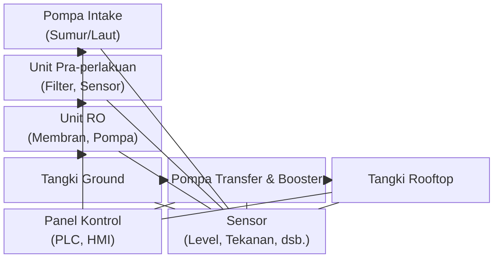

# Posisi Utilitas PDAB

Penataan posisi utilitas dalam sistem PDAB sangat penting untuk memastikan efisiensi operasional, kemudahan pemeliharaan, dan keamanan sistem secara keseluruhan. Berikut penjelasan posisi dan peran strategis masing-masing utilitas:

## Diagram Posisi Utilitas

## 1. Panel Kontrol
Panel kontrol ditempatkan di ruang kontrol atau dekat area proses utama. Lokasi ini dipilih agar operator mudah memantau dan mengendalikan seluruh sistem, serta memudahkan akses saat troubleshooting atau pemeliharaan.

## 2. Pompa Intake
Pompa intake dipasang di area sumber air (sumur atau laut) untuk memudahkan pengambilan air baku secara langsung dan mengurangi kehilangan tekanan akibat jarak distribusi.

## 3. Unit Pra-perlakuan
Unit pra-perlakuan ditempatkan dekat intake dan sebelum unit RO. Penempatan ini memastikan air baku yang masuk ke RO sudah melalui proses penyaringan awal, sehingga memperpanjang umur membran RO.

## 4. Unit RO
Unit RO berada di ruang proses utama, biasanya terpusat dengan akses mudah untuk pemantauan dan perawatan. Penempatan ini juga mempertimbangkan kebutuhan ruang dan keamanan dari paparan lingkungan luar.

## 5. Tangki Ground
Tangki ground diletakkan setelah unit RO dan sebelum pompa transfer. Fungsinya sebagai penampung sementara air hasil olahan sebelum didistribusikan lebih lanjut.

## 6. Pompa Transfer & Booster
Pompa transfer dan booster ditempatkan di ruang pompa, di antara tangki ground dan tangki rooftop. Penempatan ini memudahkan pengaturan tekanan dan aliran air ke tangki rooftop maupun ke jaringan distribusi.

## 7. Tangki Rooftop
Tangki rooftop dipasang di atap bangunan untuk memanfaatkan gravitasi dalam distribusi air ke seluruh jaringan pelanggan, serta sebagai cadangan saat terjadi gangguan pasokan.

## 8. Sensor
Sensor (level, tekanan, flow, turbidity) dipasang pada titik-titik strategis di seluruh sistem, seperti pada tangki, pipa, dan unit proses. Penempatan sensor disesuaikan dengan kebutuhan monitoring dan kontrol otomatis.

Dengan penataan posisi utilitas yang tepat, sistem PDAB dapat beroperasi secara optimal, mudah dipantau, dan efisien dalam pemeliharaan.
