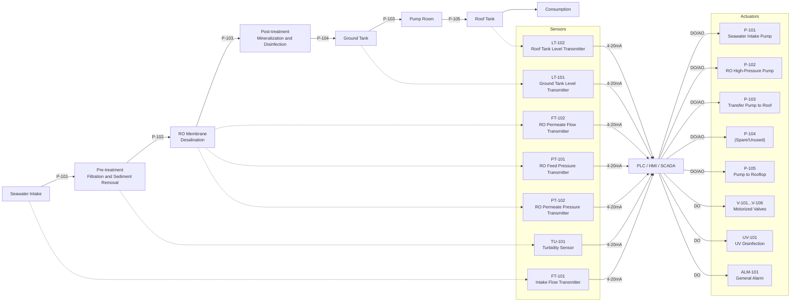
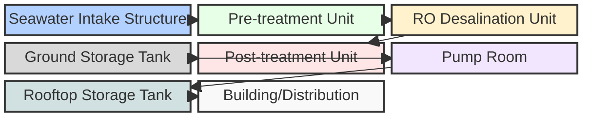

# Desalination System Flowchart (Mermaid)

*Legend (based on I/O Table):*
- **Sensors**: Measure process variables, send 4–20 mA signals to PLC
- **PLC/HMI/SCADA**: Receives sensor inputs, controls actuators
- **Actuators**: Receive commands from PLC (DO/AO)
- **Dashed arrows**: Sensor measurement points (from process to sensor)
- **Solid arrows**: Water/process flow
- **Arrows labeled 4-20mA/DO/AO**: Signal direction

*Notes:*
- AI: Analog Input, AO: Analog Output, DO: Digital Output, Comm: Communication
- Arrows with solid lines represent main process flow.
- Dashed arrows represent valve actuation or sensor signal paths.
- Each label corresponds to a device or instrument in the I/O table.

# Logic Algorithm Flowchart (Mermaid)

*This flowchart represents the main logic algorithm for the desalination control system, focusing on process decisions and actions rather than I/O wiring.*

# Hardware Siteplan (Mermaid)

# Hardware Specifications are now in [hardware-spec.md](./hardware-spec.md)
