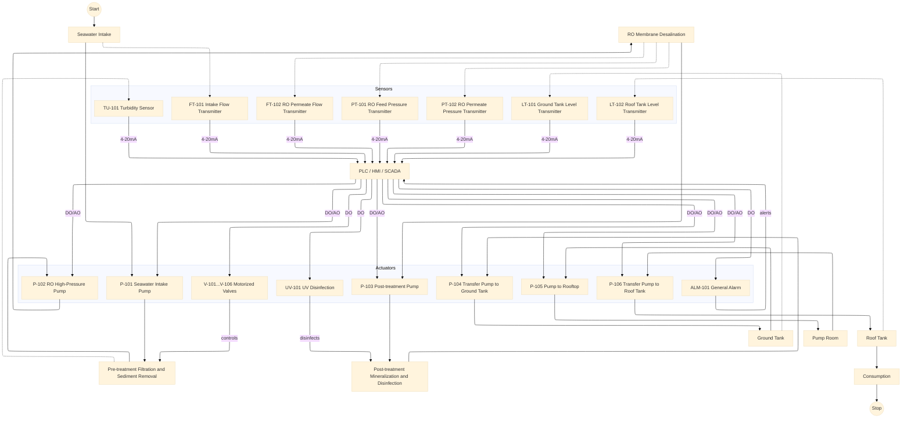
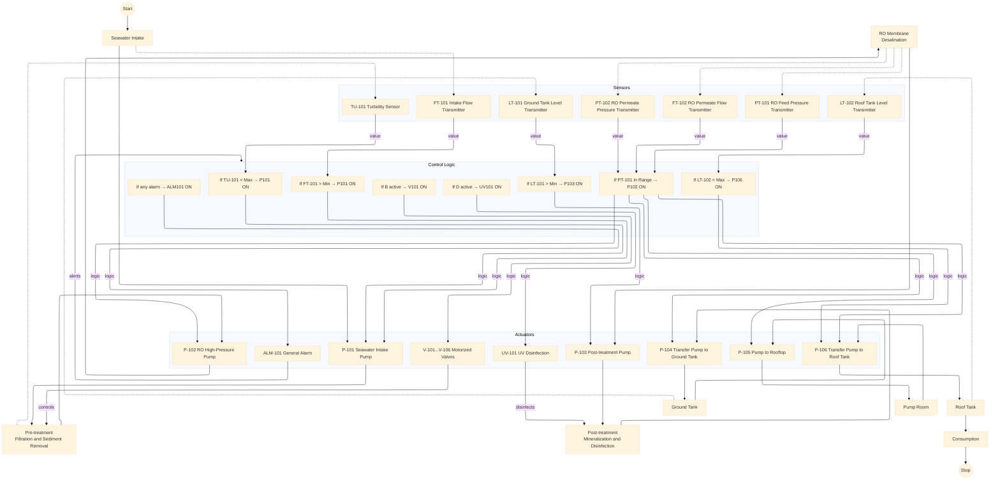
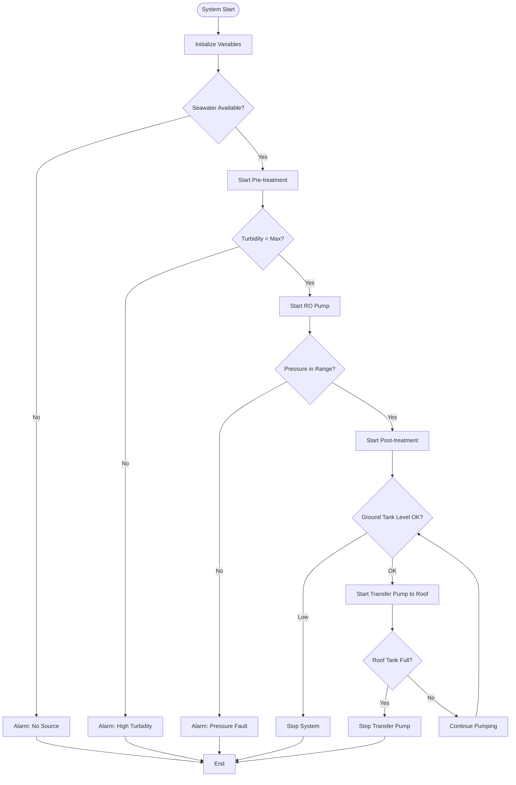
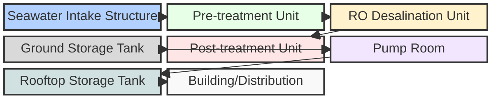

# Desalination System Process and Control Architecture

# Desalination System Flowchart (Detailed Control & Logic)

*Legend (based on I/O Table):*
- **Sensors**: Measure process variables, send values to logic group
- **Control Logic**: Functions that connect sensor outputs to actuator inputs
- **Actuators**: Shown as blocks in the process pipeline, receive commands from logic
- **Dashed arrows**: Sensor measurement points (from process to sensor)
- **Solid arrows**: Water/process flow
- **Arrows labeled value/logic**: Signal and logic direction

*Notes:*
- AI: Analog Input, AO: Analog Output, DO: Digital Output, Comm: Communication
- Arrows with solid lines represent main process flow.
- Dashed arrows represent valve actuation or sensor signal paths.
- Each label corresponds to a device or instrument in the I/O table.

# Logic Algorithm Flowchart (Mermaid)

*This flowchart represents the main logic algorithm for the desalination control system, focusing on process decisions and actions rather than I/O wiring.*

# Hardware Siteplan (Mermaid)

# Hardware Specifications are now in [hardware-spec.md](./hardware-spec.md)
